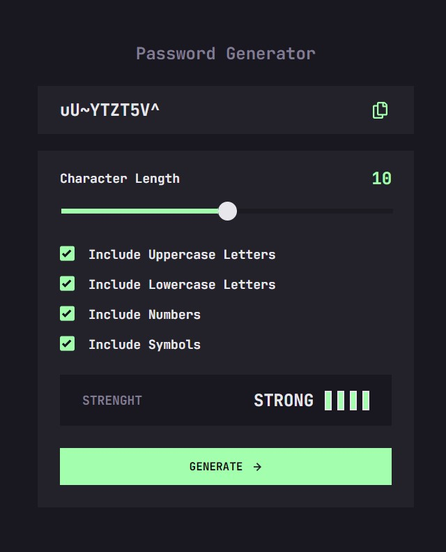
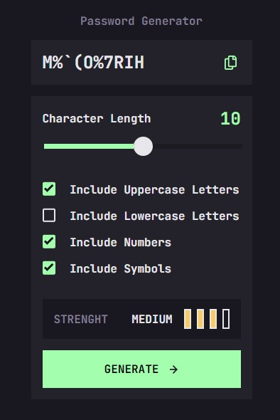

### Screenshot





### Built with

- Semantic HTML5 markup
- CSS custom properties
- Flexbox
- CSS Grid
- Mobile-first workflow
- JavaScript


### What I learned

Use this section to recap over some of your major learnings while working through this project. Writing these out and providing code samples of areas you want to highlight is a great way to reinforce your own knowledge.

To see how you can add code snippets, see below:


```js

use algorithm for generate password
  for (const check of Object.values(values).filter(v => typeof v === 'object' && v.value)) {
    characterPools.push(check.character);
    password += check.character[Math.floor(Math.random() * check.character.length)];
  }

```


## Author

- Frontend Mentor - [@yourusername](https://www.frontendmentor.io/profile/frontend-en)
